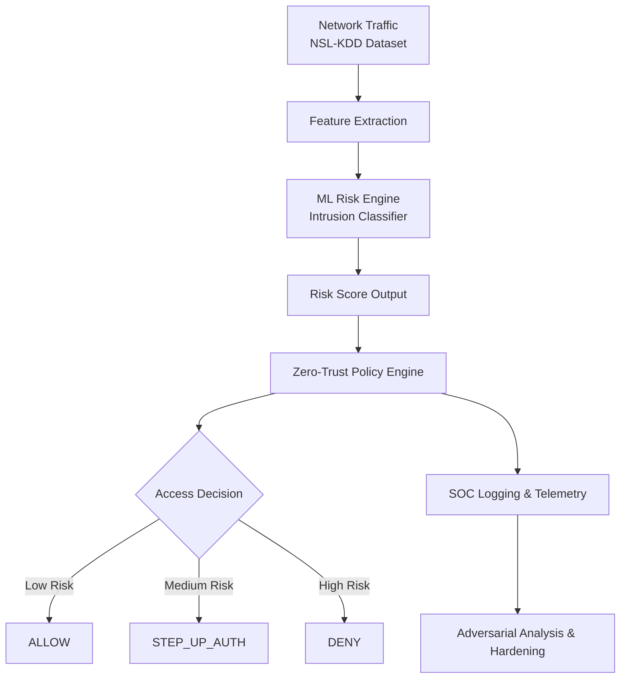

# Adversarial Attack Detection in Zero-Trust Networks

[](https://www.python.org/downloads/)
[](https://opensource.org/licenses/MIT)
[](https://streamlit.io/)

> **Executive Summary**: This project simulates adversarial evasion attempts against ML-based network intrusion detection systems operating within a Zero-Trust architecture. It evaluates how adversarially altered network traffic can bypass risk-based access control and demonstrates layered defensive policies enforcing identity and device trust scores.

---

## 🏗️ Architecture Overview

### System Flow (Zero-Trust Simulation)



### Logical Pipeline

```text
┌──────────────────────────────┐      ┌──────────────────────────────┐
│  Network Traffic (NSL-KDD)   │      │   ML Risk Engine (NN/RF)     │
│  - Bytes, Flags, Protocols   │ ───▶ │   - Outputs Risk Score (0-1) │
└──────────────────────────────┘      └──────────────────────────────┘
                                                     │
                                                     ▼
┌──────────────────────────────┐      ┌──────────────────────────────┐
│    SOC Telemetry Logging     │      │   Zero-Trust Policy Engine   │
│    - Decision Audit Trails   │ ◀─── │   - Identity & Device Trust  │
└──────────────────────────────┘      │   - Multi-factor Logic       │
                                      └──────────────────────────────┘
```

---

## ⚡ Quick Example

Process a network flow through the Zero-Trust pipeline in just a few lines:

```python
from src.system.zero_trust_network import ZeroTrustNetworkSystem

# 1. Initialize the Zero-Trust System
system = ZeroTrustNetworkSystem(model_path='models/network_risk_classifier.pth')

# 2. Process a connection request (NSL-KDD features)
result = system.process_network_request(flow_features, flow_index=123)

# 3. Inspect the context-aware decision
print(f"Outcome: {result['decision'].value}") # e.g., DENY or STEP_UP_AUTH
print(f"Policy Reason: {result['reason']}")
```

---

## 🚀 Getting Started

### 1. Installation

```bash
# Clone the repository
git clone https://github.com/Aarnav-Singh/adversarial-ml-security-framework.git
cd adversarial-ml-security-framework

# Install dependencies
pip install -r requirements.txt
```

### 2. Implementation & Testing

The system is ready to run with pre-trained models.

```bash
# Run the end-to-end integration test
python scripts/test_zero_trust_system.py

# (Optional) Re-train the baseline classifier
python scripts/train_baseline.py
```

### 3. Launch the Dashboard

Visualize real-time decision making and adversarial impacts:

```bash
streamlit run src/dashboard/app.py
```

---

## 📊 Reproducibility & Data

This project uses the **NSL-KDD dataset**, the industry benchmark for network intrusion detection.

- **Datasets**: Located in `data/` (`KDDTrain+.txt`, `KDDTest+.txt`).
- **Source**: [University of New Brunswick CIC](https://www.unb.ca/cic/datasets/nsl.html).
- **Features**: 41 network-layer features (TCP/UDP stats, service flags, duration).

### Model Performance

- **Accuracy**: ~78.5%
- **Precision**: 97.2% (Optimized for minimal false positives in SOC environments)

---

## 📁 Project Structure

```text
├── src/
│   ├── attacks/        # FGSM & PGD evasion simulations
│   ├── policy/         # Zero-Trust engine & context building
│   ├── risk_engine/    # ML Classifiers (Neural Networks)
│   └── system/         # Root integration logic
├── data/               # NSL-KDD dataset artifacts
├── models/             # Serialized model weights & preprocessors
├── scripts/            # Training & production test scripts
├── tests/              # technical unit & integration tests
└── docs/               # Deep-dive documentation index
```

---

## 🛡️ Zero-Trust Policy Logic

1. **High ML Risk (>0.8)** → **DENY**
2. **Untrusted Device (<0.5)** + Elevated Risk → **DENY**
3. **Untrusted Device (<0.5)** + Low Risk → **STEP_UP_AUTH** (MFA Required)
4. **Geo-Risk Boundary (>0.7)** → **MFA Challenge**
5. **Default Case** → **ALLOW** (with rate limiting if risk > 0.6)

---

## 📄 License & Purpose

This repository is maintained by **Aarnav Singh** for research into Adversarial Machine Learning and Zero-Trust Network Security.

*Legal Disclaimer: This software is for educational use only. Implementation in production environments should undergo rigorous security auditing.*
