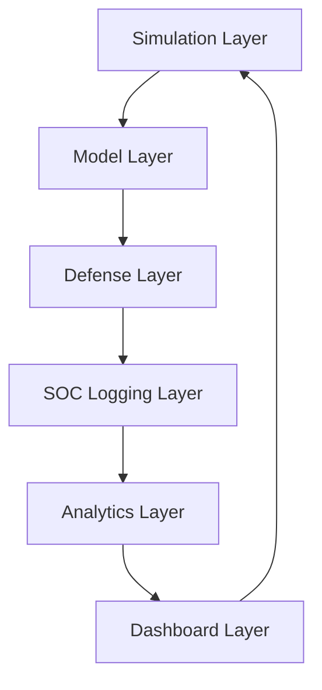

# Architecture Overview: Adversarial ML Security Framework

This document details the high-level architecture, component interactions, and data flow within the Adversarial ML Security Framework.

## 1. High-Level Architecture

The framework is a modular system designed to explore and evaluate adversarial attacks on machine learning models in a Zero-Trust environment.

## 2. Core Components

### Simulation Layer (src/simulation)

- **Traffic Generator**: Simulates benign network traffic patterns (packet size, flow duration, etc.).
- **Attack Generator**: Generates adversarial perturbations using HopSkipJump (Black-Box) and FGM (White-Box) algorithms.

### Model Layer (src/training)

- **Core Model**: The primary Random Forest classifier used for traffic categorization.
- **Surrogate Model**: A secondary model used to approximate the core model's decision boundary for white-box attack generation.
- **Retraining Engine**: Automates the fine-tuning of models using adversarial samples discovered during simulations.

### Defense Layer (src/core)

- **Ensemble Defense**: Combines multiple layers including an Anomaly Detector (Isolation Forest) and a Zero-Trust Confidence Validator.
- **Metrics Engine**: Calculates precision, recall, and Attack Success Rate (ASR) under various conditions.

### Logging Layer (src/logging)

- **Log Manager**: A centralized event tracker that serializes attack and defense metadata into JSON, Markdown, and CSV.
- **Attack Wrappers**: Drop-in logic that ensures every simulation event is automatically registered in the SOC history.

### Analytics and Dashboard (src/dashboard)

- **Blue Team Dashboard**: A Streamlit-based UI for monitoring and verification.
- **Analytics Layer**: Summarizes attack patterns and suggests potential hardening configurations.

## 3. Data Flow

1. **Ingress**: BENIGN or ADVERSARIAL samples are presented to the system.
2. **Detection**: The Isolation Forest checks for distribution shift (anomaly detection).
3. **Confidence Check**: The Policy Model generates a probability; if below the Zero-Trust threshold, the request is BLOCKED.
4. **Logging**: Every decision (ALLOW/BLOCK) is captured by the `LogManager`.
5. **Analytics**: Periodically, the Blue Team engine scans logs for vulnerabilities.
6. **Fortification**: Hardening configurations (Thresholds/Weights) can be applied to the core layers.

## 4. Key Security Controls

- **Zero-Trust**: No request is trusted by default; every input requires a high-confidence signature.
- **Adversarial Resilience**: Models can be retrained on adversarial samples identified during simulations to increase the cost of future exploitation.
- **Explainability**: SHAP (Shapley Additive Explanations) is used to verify why specific traffic was allowed or blocked.
