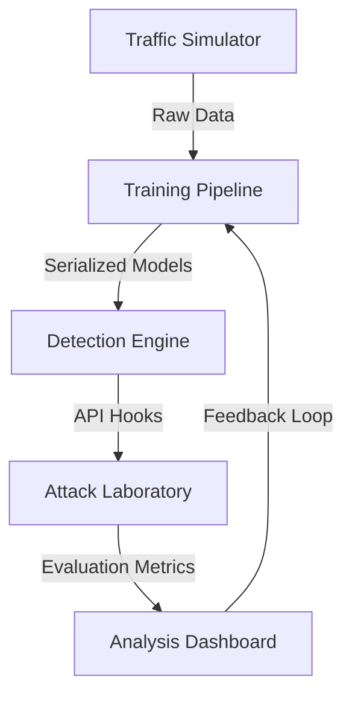

# Implementation Design: Modular Adversarial Defense

This document details the technical design of the framework, providing a roadmap of the modular evolution from a baseline system to a modular adversarial defense implementation.

## 1. Core Architecture

The system follows a **Separation of Concerns (SoC)** model, decoupling data generation, model training, and attack evaluation.

## 2. Component Breakdown

### A. Traffic Simulation (`src/simulation/`)

- **Traffic Generator**: Produces synthetic network logs (Packet size, Flow duration, Request frequency, etc.) with a configurable "Benign" profile.
- **Attack Generator**: Implements the logic for malicious injection, ensuring perturbations remain within the protocol bounds defined in the `threat_model.md`.

### B. Detection Engine (`src/core/`, `src/training/`)

- **Isolation Forest**: Handles unsupervised anomaly detection, acting as a "Zero-Trust" inspired gatekeeper.
- **Random Forest**: The primary classifier trained to distinguish between Benign and Malicious patterns.
- **Defense Module**: Implements adversarial fortification via FGM-augmented training sets.

### C. Attack Laboratory (`src/attacks/`)

- **Black-Box HSJ**: A decision-boundary attack that uses query-feedback to find minimum perturbations.
- **Epsilon Sweeps**: Automated testing of model resilience across varying levels of noise (0.0 to 1.0).

### D. Analysis Dashboard (`src/dashboard/`)

- **Real-Time Feed**: Simulation of live network traffic.
- **Resilience Comparisons**: Side-by-side bar charts and stress tests comparing Baseline vs. Fortified models.
- **Explainability (SHAP)**: Feature importance reporting to identify which network markers act as primary defense drivers.

## 3. Engineering Rigor

- **Deterministic Seeding**: Global seeds are managed in `src/core/utils.py` to ensure reproducibility across different environments.
- **Reproducibility**: Experiment results are logged and can be re-evaluated using exported JSON session logs.
- **Metric Decoupling**: Statistics (T-Tests, Confidence Intervals) are calculated in dedicated modules (`src/evaluation/statistics.py`) rather than being hardcoded in UI layers.

---
*Technical Documentation for the Adversarial ML Security Framework.*
